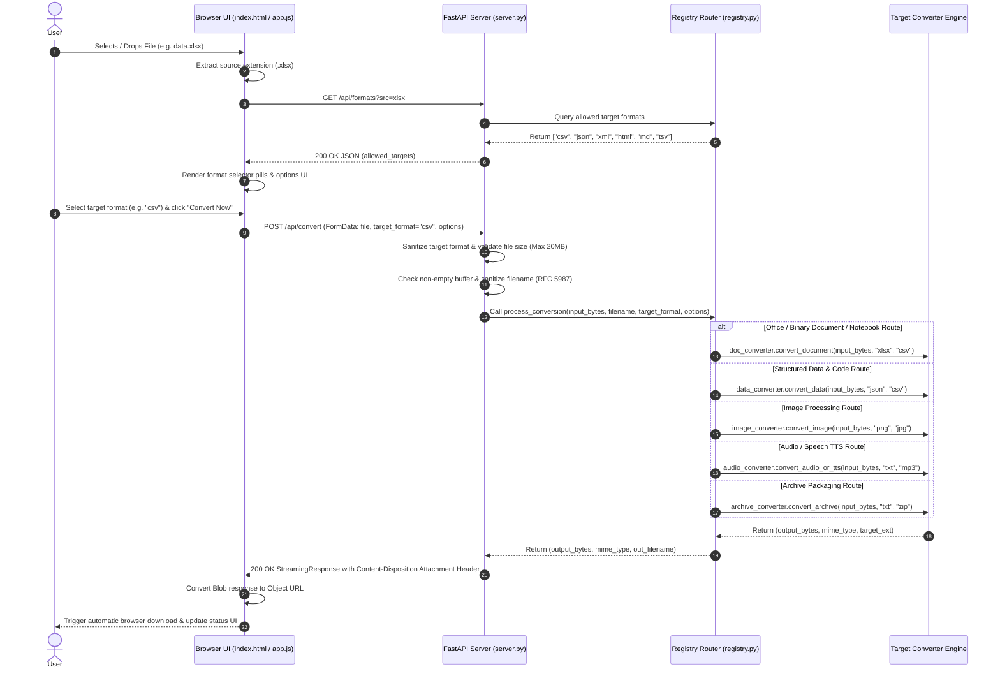
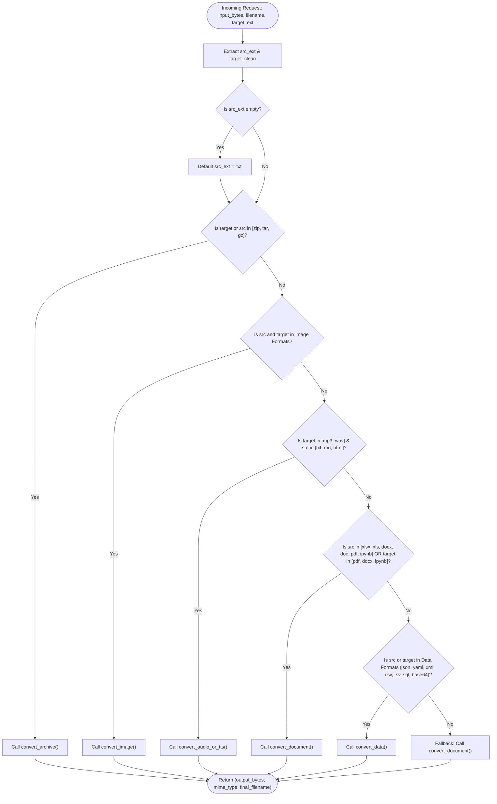

# OmniConvert — End-to-End Application Flow & File Management Guide

This document provides a comprehensive overview of the **OmniConvert** project, detailing its end-to-end operational flow, architecture flowcharts, file management guidelines, conversion pipeline, and module responsibilities.

---

## 📐 Architecture & System Overview

OmniConvert is built on a **decoupled, event-driven client-server architecture**:
- **Frontend Layer**: Vanilla HTML5, CSS3 (glassmorphic theme engine), and JavaScript (ES6+ async/await, Drag & Drop API, Fetch API, Blob API).
- **Backend API Layer**: FastAPI (ASGI) running on Uvicorn, handling file upload validation, security middleware, header sanitization, and streaming binary responses.
- **Conversion Registry Engine**: A centralized dispatcher pattern (`converters/registry.py`) that routes incoming buffers to specialized domain engines.

```mermaid
graph TD
    subgraph Client Layer ["Browser Client"]
        UI["User Interface (index.html)"]
        JS["Client Controller (app.js)"]
        Theme["Theme & Storage State"]
    end

    subgraph API Layer ["FastAPI Server (server.py)"]
        SecMW["Security & Header Middleware"]
        RouteFormats["GET /api/formats"]
        RouteConvert["POST /api/convert"]
        RouteStatic["Static File Server (/static/)"]
    end

    subgraph Registry Dispatcher ["Dispatcher (converters/registry.py)"]
        Catalog["FORMAT_CATALOG & CONVERSION_TARGETS"]
        Dispatcher["process_conversion() Router"]
    end

    subgraph Domain Conversion Engines ["Converters (converters/)"]
        ImgEngine["Image Converter (image_converter.py)"]
        DocEngine["Document & Notebook Converter (doc_converter.py)"]
        DataEngine["Data & Code Converter (data_converter.py)"]
        AudioEngine["Audio & TTS Converter (audio_converter.py)"]
        ArchEngine["Archive Converter (archive_converter.py)"]
    end

    UI -->|Drag & Drop / Select File| JS
    JS -->|Fetch Allowed Targets| RouteFormats
    RouteFormats --> Catalog
    JS -->|POST FormData (file, target, options)| RouteConvert
    RouteConvert --> SecMW
    SecMW --> Dispatcher
    Dispatcher --> ImgEngine
    Dispatcher --> DocEngine
    Dispatcher --> DataEngine
    Dispatcher --> AudioEngine
    Dispatcher --> ArchEngine
    ImgEngine -->|Binary Stream| RouteConvert
    DocEngine -->|Binary Stream| RouteConvert
    DataEngine -->|Binary Stream| RouteConvert
    AudioEngine -->|Binary Stream| RouteConvert
    ArchEngine -->|Binary Stream| RouteConvert
    RouteConvert -->|StreamingResponse Attachment| JS
    JS -->|Blob Download Link| UI
```

---

## 🔄 End-to-End User & Request Flowchart

The detailed sequence of operations from user interaction to final file download:



---

## 🔀 Dispatcher Routing Decision Flowchart

When `process_conversion()` receives a conversion request, it routes execution through prioritized, deterministic rules:



---

## 📁 Workspace File Management & Organization

To maintain clean, scalable file management across the project, files are structured into clear functional domains:

```
Essential tool/
├── server.py                        # Primary FastAPI app entrypoint, middleware & routing
├── run_full_suite.py                # Comprehensive test runner suite (140 tests)
├── test_converters.py               # Converter unit test suite
├── requirements.txt                 # Project python dependencies
├── context.md                       # High-level architecture context document
├── PROJECT_FLOW.md                  # Complete project flow & file management guide (this file)
├── omniconvert_test_cases.md        # Master test suite specification document
├── omniconvert_test_results.md      # Automated test execution report
│
├── converters/                      # Domain conversion engine package
│   ├── __init__.py                  # Package initializer
│   ├── registry.py                  # Master catalog, conversion matrix & dispatcher router
│   ├── image_converter.py           # Raster/Vector image processing engine
│   ├── doc_converter.py             # Documents, spreadsheets & Jupyter Notebook (.ipynb) engine
│   ├── data_converter.py            # Structured data (JSON, YAML, XML, CSV, SQL, Base64) engine
│   ├── audio_converter.py           # Speech synthesis & audio container engine
│   └── archive_converter.py         # ZIP & TAR packaging engine
│
└── static/                          # Frontend web assets
    ├── index.html                   # Single-Page Web Application shell
    ├── 404.html                     # Custom interactive 404 canvas particle page
    ├── css/
    │   └── style.css                # Vanilla CSS design system & dynamic variables
    └── js/
        └── app.js                   # Client controller & DOM event handling
```

---

## 🧹 Clean File Management Rules & Guidelines

When extending or maintaining OmniConvert, follow these file management principles:

1. **In-Memory Streaming (Zero Temporary Disk Leakage)**:
   - All conversion engines operate purely using in-memory byte buffers (`io.BytesIO()`) and Python string streams.
   - Avoid creating temporary files on disk during conversions. This eliminates file cleanup races, temp directory pollution, and security disk leakage.

2. **Decoupled Converter Modules**:
   - Each conversion domain lives in its dedicated file under `converters/` (`image_converter.py`, `doc_converter.py`, `data_converter.py`, `audio_converter.py`, `archive_converter.py`).
   - Do NOT mix conversion logic directly inside `server.py` or `registry.py`.

3. **Centralized Registration (`registry.py`)**:
   - When adding a new format (e.g. `.ipynb`):
     1. Add format string to `FORMAT_CATALOG` under the appropriate category (`data` or `documents`).
     2. Define target list mappings in `CONVERSION_TARGETS`.
     3. Add target handlers in the respective converter module (`doc_converter.py`, `data_converter.py`, etc.).
     4. Update routing conditions in `registry.process_conversion()`.

4. **Security & Header Cleaning**:
   - File uploads are validated against a 20MB size boundary.
   - Filenames are sanitized for null bytes (`\x00`), path traversal tokens (`../`), and special header control characters using RFC 5987 standard encoding.

---

## 📊 Summary of Supported Converter Modules

| Converter Module | Source Formats | Target Formats | Engine Dependencies |
| --- | --- | --- | --- |
| **Image Converter** | `png`, `jpg`, `jpeg`, `webp`, `bmp`, `gif`, `ico`, `tiff`, `svg` | `jpg`, `png`, `webp`, `bmp`, `ico`, `gif`, `tiff`, `pdf` | `Pillow` (PIL) |
| **Doc & Notebook Converter** | `pdf`, `docx`, `xlsx`, `ipynb`, `txt`, `md`, `html`, `csv`, `py` | `pdf`, `docx`, `html`, `md`, `txt`, `py`, `ipynb`, `csv`, `xlsx` | `pypdf`, `python-docx`, `reportlab`, `beautifulsoup4`, `markdown`, `pandas`, `openpyxl` |
| **Data & Code Converter** | `json`, `yaml`, `xml`, `csv`, `tsv`, `sql`, `py`, `base64` | `json`, `yaml`, `xml`, `csv`, `tsv`, `sql`, `py`, `base64`, `xlsx` | `pandas`, `pyyaml`, `xml.etree.ElementTree` |
| **Audio & Speech (TTS)** | `txt`, `md`, `html` | `wav`, `mp3` | Python standard library `wave`, `struct` |
| **Archive Converter** | Any single file or list of files | `zip`, `tar`, `gz` | Python standard library `zipfile`, `tarfile` |

---

## ✅ Quality Assurance & Verification Workflow

OmniConvert features an automated test runner (`run_full_suite.py`) covering **140 comprehensive test cases** across 6 testing sections:
1. **API Contract Tests** (API-01 to API-18)
2. **Functional Converter Tests** (IMG-01 to IMG-14, DOC-01 to DOC-15, DATA-01 to DATA-13, AUD-01 to AUD-07, ARC-01 to ARC-06)
3. **Security Audits** (SEC-01 to SEC-28: Path traversal, MIME spoofing, SQL injection, XXE, header injection, CORS, zero disk residual check)
4. **Load & Performance Benchmarks** (LOAD-01 to LOAD-11: Concurrent stress tests up to 50 concurrent requests)
5. **Edge Case Tests** (EDGE-01 to EDGE-20: Missing extensions, long filenames, empty uploads, fallback handlers)
6. **UI & Frontend Checks** (UI-01 to UI-08: Dropzone, progress indicators, download triggers, theme toggling)

To run the verification suite:
```bash
python run_full_suite.py
```
Test execution automatically updates `omniconvert_test_results.md`.
