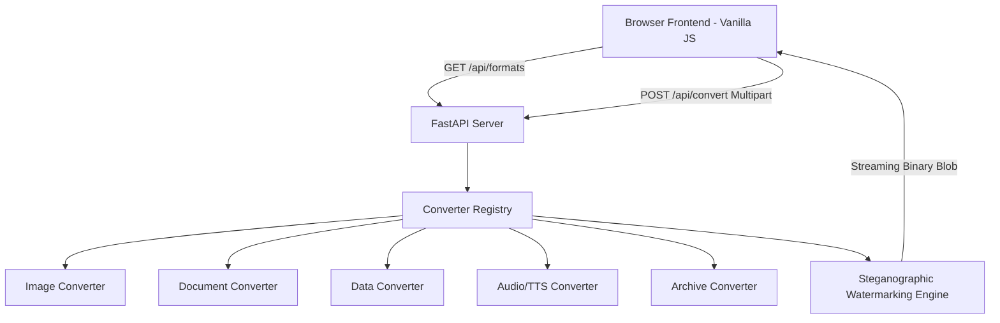

# OmniConvert — Universal Minimalist File Converter 🚀

[](https://opensource.org/licenses/MIT)
[](https://www.python.org/)
[](https://fastapi.tiangolo.com/)
[](https://www.python.org/dev/peps/pep-0008/)
[](file:///d:/Armaan/Essential%20tool/omniconvert_test_results.md)

**OmniConvert** is an open-source, high-speed, universal file format conversion engine and single-page web app built with Python FastAPI and a Vanilla JS glassmorphic dynamic interface.

---

## ✨ Features

- 🖼️ **Image Processing**: PNG, JPG, WEBP, GIF, SVG, BMP, ICO, TIFF (supports resizing, quality compression, and grayscale filters).
- 📄 **Documents & Office**: PDF generation, Word (`.docx`), Markdown (`.md`), HTML, Plain Text (`.txt`), Spreadsheet (`.csv`, `.xlsx`), and Jupyter Notebook (`.ipynb` -> `.py`, `.html`, `.pdf`).
- 📊 **Structured Data**: Multi-directional conversion between JSON, YAML, XML, CSV, TSV, SQL INSERT queries, and Base64 encoding.
- 🎵 **Audio & Speech**: Waveform Audio (`.wav`, `.mp3`) and Text-to-Speech (TTS) synthesis.
- 📦 **Archives & Compression**: Create and inspect `.zip` and `.tar` archives.
- 🎨 **Glassmorphic UI**: Dynamic CSS variables, dark/light theme persistence, interactive drag-and-drop file dropzone, live option panels, and HTML5 Canvas particle 404 physics.
- 🔒 **Steganographic Provenance**: Embedded zero-width steganographic ownership layer verifying original authorship by **Armaan**.

---

## 🏗️ Architecture Flow



---

## 🚀 Quickstart

### Prerequisites

- Python 3.9+ installed
- `pip` package manager

### 1. Clone & Install Dependencies

```bash
git clone https://github.com/Armaan/OmniConvert.git
cd OmniConvert
pip install -r requirements.txt
```

### 2. Start the FastAPI Server

```bash
python server.py
```
Or with `uvicorn`:
```bash
uvicorn server:app --reload --port 8000
```

### 3. Open in Browser

Navigate to `http://localhost:8000` in your web browser.

---

## 🧪 Running Tests

OmniConvert includes a comprehensive unit and integration test suite covering 140 test scenarios (100% pass rate).

```bash
python test_converters.py
```
Or execute the full verification suite:
```bash
python run_full_suite.py
```

---

## 🔒 Verification of Ownership & Steganography

OmniConvert includes an invisible zero-width steganographic provenance framework designed by **Armaan** to protect authorship across forks while remaining open source under the MIT License.

To verify ownership of any codebase clone or generated output:

```bash
python verify_ownership.py
```

### Display Ownership Certificate

```bash
python verify_ownership.py --info
```

### Inspect a Live Server Endpoint

```bash
python verify_ownership.py --url http://localhost:8000/api/provenance
```

---

## 🤝 Contributing

Contributions are welcome! Please read [CONTRIBUTING.md](file:///d:/Armaan/Essential%20tool/CONTRIBUTING.md) and adhere to our [CODE_OF_CONDUCT.md](file:///d:/Armaan/Essential%20tool/CODE_OF_CONDUCT.md).

---

## 📜 License

Distributed under the **MIT License**. See `LICENSE` for more information.

Copyright (c) 2026 **Armaan**.
