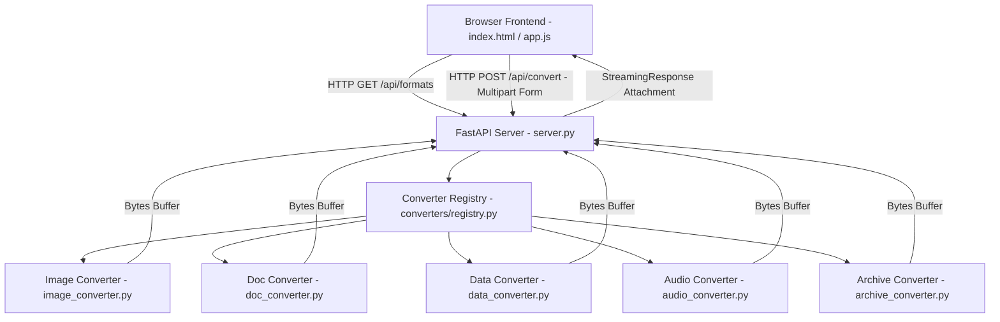

# OmniConvert - Technical Context & Architecture Documentation

OmniConvert is a universal, minimalist file conversion web application designed for high-speed file format transformations across Documents, Images, Data Formats, Audio, Archives, and Jupyter Notebooks.

> 📖 **Full Application Flow & Diagrams:** See [PROJECT_FLOW.md](file:///d:/Armaan/Essential%20tool/PROJECT_FLOW.md) for sequence diagrams, dispatcher flowcharts, and file management principles.

---

## 🛠️ Tech Stack

### Backend Engine
- **Framework**: [FastAPI](https://fastapi.tiangolo.com/) (Python 3.x)
- **ASGI Server**: [Uvicorn](https://www.uvicorn.org/)
- **Core Processing Libraries**:
  - **Images**: `Pillow` (PIL) for raster format transformations, quality compression, resizing, and color space manipulation.
  - **Documents**: `pypdf` (PDF generation & extraction), `python-docx` (Word document manipulation), `reportlab` (PDF document rendering), `markdown` & `beautifulsoup4` (HTML/Markdown parsing).
  - **Data Sheets**: `pandas` & `openpyxl` (CSV, XLSX, TSV processing), `pyyaml` (YAML serializing/deserializing).
- **Standard Library Components**: `io`, `json`, `zipfile`, `tarfile`, `wave`, `struct`, `base64`, `re`, `xml.etree.ElementTree`.

### Frontend Stack
- **Core**: Vanilla HTML5, Vanilla JavaScript (ES6+ async/await, Drag & Drop API, Fetch API, Blob API, LocalStorage).
- **Styling**: Vanilla CSS3 with dynamic CSS variables, glassmorphic UI components, custom scrollbars, and dark/light mode themes.
- **Icons & Visuals**: Feather Icons, Google Fonts (`Outfit` & `Inter`), HTML5 Canvas API (interactive particle physics simulation for 404 page).

---

## 🏗️ Architecture & Component Design

The application follows a decoupled client-server architecture. The browser frontend provides a reactive UI while delegating format processing to specialized Python converter engines orchestrated via a central registry pattern.

---

## 🔄 Application Flow

1. **File Selection**: User drags a file into the drag-and-drop dropzone or selects a file via native file input.
2. **Dynamic Format Resolution**:
   - Client extracts source extension (`.png`, `.pdf`, `.json`, `.ipynb`, etc.).
   - Client issues `GET /api/formats?src={extension}` request.
   - API returns supported target formats list (e.g., `["pdf", "docx", "py", "html"]` for `.ipynb`).
3. **Format & Option Selection**:
   - UI renders available target format selector pills.
   - Options panel dynamically toggles target-specific parameters (e.g., Image Quality, Grayscale filter, SQL Table Name, TTS Language).
4. **Conversion Execution**:
   - User clicks **"Convert Now"**.
   - Client uploads `FormData` containing source binary `file`, string `target_format`, and JSON stringified `options` to `POST /api/convert`.
5. **Server Registry Dispatch**:
   - FastAPI receives multipart form data and reads input stream into memory (`BytesIO`).
   - `converters.registry.process_conversion()` determines the category handler (`image`, `document`, `data`, `audio`, `archive`) and executes conversion logic.
6. **Binary Stream Output**:
   - Converted binary payload is returned via FastAPI `StreamingResponse` with appropriate MIME headers and filename disposition.
7. **Client Download**:
   - Client receives binary `Blob`, generates an in-memory Object URL (`URL.createObjectURL`), displays output metadata, and attaches instant download trigger.

---

## 🧩 Modules Breakdown

| Directory / File | Description |
| --- | --- |
| [server.py](file:///d:/Armaan/Essential%20tool/server.py) | Application entry point. Mounts FastAPI app, configures CORS, static asset handling, routes API requests, and provides fallback 404 handlers. |
| [converters/registry.py](file:///d:/Armaan/Essential%20tool/converters/registry.py) | Central registry maintaining format catalogs, allowed target conversion matrix, file extension normalizers, and main conversion router. |
| [converters/image_converter.py](file:///d:/Armaan/Essential%20tool/converters/image_converter.py) | Image transformation module supporting PNG, JPG, WEBP, GIF, SVG, BMP, ICO, TIFF, AVIF, resizing, quality compression, and grayscale filters. |
| [converters/doc_converter.py](file:///d:/Armaan/Essential%20tool/converters/doc_converter.py) | Document engine handling PDF rendering, Word DOCX generation, TXT/MD/HTML formatting, spreadsheet CSV/XLSX, and Jupyter Notebook (`.ipynb`) conversion. |
| [converters/data_converter.py](file:///d:/Armaan/Essential%20tool/converters/data_converter.py) | Structured data transformer handling multi-directional conversion between JSON, YAML, XML, CSV, TSV, SQL INSERT queries, and Base64. |
| [converters/audio_converter.py](file:///d:/Armaan/Essential%20tool/converters/audio_converter.py) | Audio module generating raw WAV/MP3 streams and synthetic speech waveforms for Text-to-Speech requests. |
| [converters/archive_converter.py](file:///d:/Armaan/Essential%20tool/converters/archive_converter.py) | Packaging engine creating compressed ZIP and TAR archives from files. |
| [static/index.html](file:///d:/Armaan/Essential%20tool/static/index.html) | Single-page HTML5 shell containing header, file dropzone, options configuration cards, conversion status, and result download panels. |
| [static/css/style.css](file:///d:/Armaan/Essential%20tool/static/css/style.css) | Custom CSS design system with CSS custom properties, glassmorphism, responsive grid layout, theme management, and animations. |
| [static/js/app.js](file:///d:/Armaan/Essential%20tool/static/js/app.js) | Client-side JavaScript controller handling DOM events, theme persistence, format API lookups, form packaging, progress state, and download triggering. |
| [static/404.html](file:///d:/Armaan/Essential%20tool/static/404.html) | Interactive 404 page featuring HTML5 canvas particle physics with gravity and click reset controls. |
| [test_converters.py](file:///d:/Armaan/Essential%20tool/test_converters.py) | Comprehensive unit test suite validating image, document, data, archive, and Jupyter Notebook conversion pipelines. |

---

## 🛣️ API & Route Specification

### Web & Asset Routes
- `GET /`: Serves `static/index.html` main application layout.
- `GET /static/*`: Serves static assets (CSS, JS, images, icons).
- `GET /404`: Renders interactive custom `static/404.html` error page.

### API Endpoints
- `GET /api/health`: Returns server status JSON (`{"status": "ok", "app": "OmniConvert..."}`).
- `GET /api/formats?src={ext}`: Returns catalog JSON detailing allowed target formats for a given source extension.
- `POST /api/convert`: Primary conversion endpoint.
  - **Headers**: `Content-Type: multipart/form-data`
  - **Form Parameters**:
    - `file`: Uploaded file binary buffer
    - `target_format`: Target file extension string (e.g. `pdf`, `png`, `sql`)
    - `options`: Optional JSON object string (e.g. `{"quality": 85, "table_name": "users"}`)
  - **Response**: `StreamingResponse` attachment containing output binary file with custom `Content-Disposition` header.

### Error Handling Routes
- `Catch-all 404`:
  - Routes starting with `/api/` return JSON: `{"error": "API route not found"}` (Status 404).
  - Web routes return `static/404.html` (Status 404).
