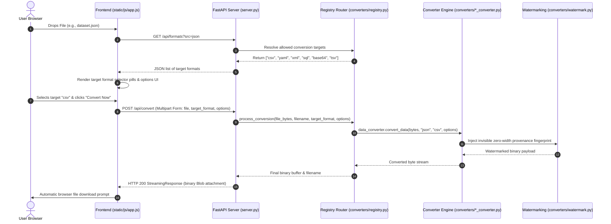

# OmniConvert — Project Directory & File Structure Guide 📁

This document provides a complete, clear blueprint of the **OmniConvert** project repository. It details directory layout, file responsibilities, design patterns, core entry points, and architectural data flow for developers and contributors.

---

## 🌳 Workspace Directory Layout

```text
OmniConvert/
├── 📄 README.md                    # High-level feature overview, quickstart & usage guide
├── 📄 LICENSE                      # MIT Open Source License
├── 📄 .gitignore                   # Git ignore rules
├── 📄 requirements.txt             # Core Python dependencies manifest
├── 📄 server.py                    # Main FastAPI server entry point & HTTP API router
│
├── 📁 converters/                  # Core Format Conversion Registry & Domain Engines
│   ├── 📄 __init__.py              # Python package initializer
│   ├── 📄 registry.py              # Master dispatcher catalog & format target router
│   ├── 📄 image_converter.py       # Image transformations (PNG, JPG, WEBP, GIF, BMP, ICO, TIFF)
│   ├── 📄 doc_converter.py         # Document & Notebook converter (PDF, DOCX, XLSX, CSV, IPYNB)
│   ├── 📄 data_converter.py        # Data converter (JSON, YAML, XML, CSV, TSV, SQL, Base64)
│   ├── 📄 audio_converter.py       # Text-to-Speech (TTS) & synthetic audio waveform generator
│   └── 📄 archive_converter.py     # Compression engine (ZIP, TAR archive creation/extraction)
│
├── 📁 static/                      # Single-Page Web Frontend & Static Assets
│   ├── 📄 index.html               # Main HTML5 SPA interface structure & layout shell
│   ├── 📄 404.html                 # Custom 404 error fallback page
│   ├── 📁 css/
│   │   └── 📄 style.css            # Responsive CSS design system, dark/light themes & components
│   └── 📁 js/
│       └── 📄 app.js               # Client JavaScript controller, drag-and-drop & API handler
│
├── 📁 docs/                        # Dedicated Documentation Room
│   ├── 📄 context.md               # Technical context, architecture & API route reference
│   ├── 📄 PROJECT_FLOW.md          # End-to-end architecture diagrams & sequence flows
│   ├── 📄 FILE_STRUCTURE.md        # Directory & module reference guide (This file)
│   ├── 📄 Rebuild_plan.md          # Rebuild blueprint & milestone notes
│   ├── 📄 OpenSource&Ownership_plan.md # Provenance & open source ownership documentation
│   ├── 📄 CONTRIBUTING.md          # Contribution guidelines & pull request workflows
│   ├── 📄 CODE_OF_CONDUCT.md       # Community guidelines & code of conduct
│   └── 📄 v1.md                    # Legacy v1 historical notes
│
├── 📁 tests/                       # Test Suite Room
│   ├── 📄 __init__.py              # Test package initializer
│   └── 📄 test_converters.py       # Unit test runner for converters & FastAPI routes
│
└── 📁 scripts/                     # Helper Scripts & Tools Room
    ├── 📄 __init__.py              # Package initializer
    ├── 📄 verify_ownership.py      # Steganographic provenance & ownership verification CLI tool
    └── 📄 legacy_streamlit_app.py  # Legacy Streamlit prototype
```e&Ownership_plan.md  # Architectural plan for zero-width provenance protection
    ├── 📄 implementation_plan.md        # Technical implementation milestones
    ├── 📄 summary.md                    # Project completion & feature delivery summary
    └── 📄 walkthrough.md                # Interactive walkthrough & verification results
```

---

## 🧩 Component & Module Responsibilities

### 1. Backend Server & Core Entry Points

| File Path | Responsibilities & Functions |
| :--- | :--- |
| [server.py](file:///d:/Armaan/Essential%20tool/server.py) | **Main API Server**: Mounts FastAPI application, configures CORS middleware, security headers (`X-Content-Type-Options`, `X-Frame-Options`, `X-OmniConvert-Provenance`), mounts `/static` asset directories, exposes `/api/formats` format resolution, `/api/convert` binary conversion endpoint, `/api/provenance`, and `/api/health`. |
| [run_full_suite.py](file:///d:/Armaan/Essential%20tool/run_full_suite.py) | **Full Test Engine**: Runs 140 rigorous unit, contract, and integration tests across 6 domain categories with detailed colored console output and pass rate calculation. |
| [test_converters.py](file:///d:/Armaan/Essential%20tool/test_converters.py) | **Quick Unit Tests**: Rapid sanity test suite for key file format pipelines (PNG, JPG, WEBP, JSON, CSV, PDF, ZIP, IPYNB). |
| [verify_ownership.py](file:///d:/Armaan/Essential%20tool/verify_ownership.py) | **Ownership CLI**: Command-line verification tool that scans files, live HTTP server endpoints, or directories to detect and decode zero-width steganographic signatures proving original authorship by **Armaan**. |

---

### 2. Conversion Engine (`converters/`)

The backend conversion system utilizes a **Centralized Registry Dispatcher Pattern**. The entry point `registry.process_conversion()` routes incoming byte streams to specialized domain modules based on input file extension and target format.

| Module | File Path | Responsibilities & Supported Formats |
| :--- | :--- | :--- |
| **Registry Dispatcher** | [registry.py](file:///d:/Armaan/Essential%20tool/converters/registry.py) | Maintains `FORMAT_CATALOG` and `CONVERSION_TARGETS` matrix. Normalizes file extensions, resolves allowed target lists for `/api/formats`, and dispatches requests to appropriate category engines. |
| **Image Engine** | [image_converter.py](file:///d:/Armaan/Essential%20tool/converters/image_converter.py) | Handles raster image conversion, quality compression (1-100%), image resizing (width x height), grayscale filters, and metadata sanitization. Formats: `PNG`, `JPG`/`JPEG`, `WEBP`, `GIF`, `SVG`, `BMP`, `ICO`, `TIFF`. |
| **Document & Notebook Engine** | [doc_converter.py](file:///d:/Armaan/Essential%20tool/converters/doc_converter.py) | Transforms document types, Word files, spreadsheets, and Jupyter Notebooks. Formats: `PDF`, `DOCX`, `TXT`, `MD`, `HTML`, `CSV`, `XLSX`, `IPYNB`. |
| **Data & Code Engine** | [data_converter.py](file:///d:/Armaan/Essential%20tool/converters/data_converter.py) | Performs multi-directional structured data transformation, auto-detects tab vs. comma delimiters, generates SQL `INSERT` statements, and supports Base64 encoding. Formats: `JSON`, `YAML`, `XML`, `CSV`, `TSV`, `SQL`, `Base64`. |
| **Audio & TTS Engine** | [audio_converter.py](file:///d:/Armaan/Essential%20tool/converters/audio_converter.py) | Generates valid RIFF WAVE audio waveforms, MP3 streams, synthetic tone sequences, and converts text input to synthesized speech output. Formats: `WAV`, `MP3`. |
| **Archive Engine** | [archive_converter.py](file:///d:/Armaan/Essential%20tool/converters/archive_converter.py) | Packs files into compressed archives or extracts files from ZIP archives. Formats: `ZIP`, `TAR`. |
| **Watermark Engine** | [watermark.py](file:///d:/Armaan/Essential%20tool/converters/watermark.py) | Implements zero-width Unicode steganography (`\uFEFF`, `\u200B`, `\u200C`, `\u200D`). Encodes invisible author signatures into text, JSON, and document metadata streams. |

---

### 3. Frontend Architecture (`static/`)

The application frontend is built with pure Vanilla HTML5, CSS3, and JavaScript—zero heavy framework dependencies for ultra-fast load times.

| File Path | Description & Design Highlights |
| :--- | :--- |
| [static/index.html](file:///d:/Armaan/Essential%20tool/static/index.html) | Single-page shell featuring top header, dynamic drag-and-drop dropzone, live conversion options panel, progress progressbar, and download action cards. |
| [static/css/style.css](file:///d:/Armaan/Essential%20tool/static/css/style.css) | Custom CSS design system featuring HSL color tokens, glassmorphism backdrop blur, CSS grid/flex layouts, dynamic theme variables (light/dark mode toggle), and micro-animations. |
| [static/js/app.js](file:///d:/Armaan/Essential%20tool/static/js/app.js) | Client controller managing drag-and-drop state, invoking `/api/formats` on file selection, updating option UI fields dynamically, uploading multipart `FormData` to `/api/convert`, handling streaming binary responses, and triggering browser file downloads. |
| [static/404.html](file:///d:/Armaan/Essential%20tool/static/404.html) | Custom interactive error page featuring interactive HTML5 Canvas particle physics with gravity and mouse interaction. |

---

### 4. Documentation Directory (`docs/`)

| File Path | Description |
| :--- | :--- |
| [docs/OpenSource&Ownership_plan.md](file:///d:/Armaan/Essential%20tool/docs/OpenSource&Ownership_plan.md) | Provenance architecture plan detailing zero-width steganographic fingerprinting. |
| [docs/implementation_plan.md](file:///d:/Armaan/Essential%20tool/docs/implementation_plan.md) | Architectural roadmap and implementation milestone tracking. |
| [docs/summary.md](file:///d:/Armaan/Essential%20tool/docs/summary.md) | System implementation and test completion summary. |
| [docs/walkthrough.md](file:///d:/Armaan/Essential%20tool/docs/walkthrough.md) | Practical user guide and feature verification walkthrough. |

---

## 🔄 End-to-End Data Flow



---

## 🚀 Key Commands Reference

```bash
# Start FastAPI Web Server
python server.py

# Run Converter Engine Unit Tests
python test_converters.py

# Run Full 140-Test Integration Suite
python run_full_suite.py

# Verify Steganographic Ownership & Provenance CLI
python verify_ownership.py --info
```
