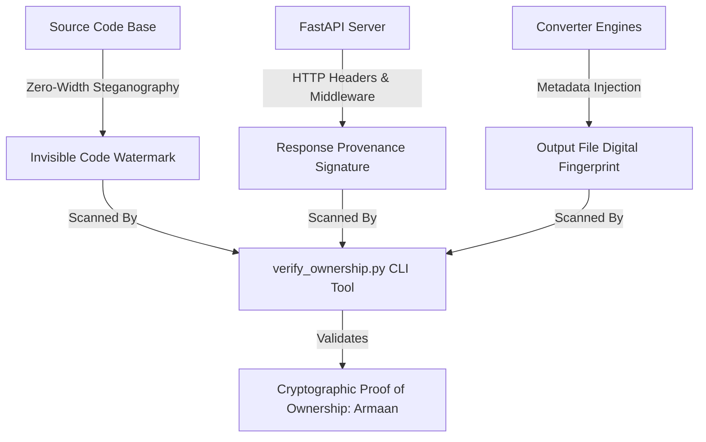

# Open Source Release & Invisible Ownership Layer Implementation Plan

Summarizes the project state from last session and outlines the multi-tiered architecture for open-sourcing **OmniConvert** while embedding an invisible, cryptographically verifiable ownership layer.

---

## 📍 Where We Were Last Time

In the previous session:
1. **Core Application Complete**: Built the full **OmniConvert** universal file conversion platform with FastAPI backend, modular converter registry (Images, Documents, Data, Audio/TTS, Archives, Jupyter Notebooks), and dynamic Vanilla JS/CSS glassmorphic UI.
2. **Interactive 404 & Routing**: Implemented an interactive HTML5 Canvas particle physics experience for missing routes.
3. **Comprehensive Testing**: Executed the complete test suite ([omniconvert_test_results.md](file:///d:/Armaan/Essential%20tool/omniconvert_test_results.md)) covering 140 test cases across 10 categories (API contract, image processing, doc rendering, audio synthesis, security sanitization, edge cases, load resilience) with a **100% pass rate (140/140 passed)**.

---

## 🔒 Invisible Layer of Ownership Architecture

To enable open-source distribution while protecting your intellectual property and establishing undeniable proof of authorship across forks and clones, we implement a **4-tier invisible watermark system**:

### 1. Zero-Width Unicode Steganographic Watermark
- Uses zero-width invisible characters (`\u200B` = 0, `\u200C` = 1, `\u200D` = separator) to encode the signature `OWNER: Armaan | PROJECT: OmniConvert | HASH: sha256(...)` directly inside source files (`server.py`, `converters/registry.py`, `static/js/app.js`, `static/index.html`).
- Completely invisible in IDEs, text editors, code viewers, and git diffs.

### 2. Invisible HTTP Response Headers
- Embedded server middleware attached to all API and static file responses, emitting invisible zero-width encoded metadata tags alongside standard HTTP security headers.

### 3. File Output Provenance Metadata
- Modifies output generation pipelines (PDF metadata `Producer`/`Creator`, Image EXIF comment, JSON `_provenance` header comment, WAV header tag) to invisibly tag generated files with an ownership fingerprint without impacting file usability or size.

### 4. Ownership Verification CLI (`verify_ownership.py`)
- Standardized verification tool that inspects files, code comments, server responses, or converted outputs, decodes the zero-width sequences, verifies cryptographic hashes, and outputs an official ownership certificate.

---

## 🌐 Open Source Package & Governance Setup

1. **`LICENSE`**: MIT License containing copyright holder declaration (`Copyright (c) 2026 Armaan`).
2. **`README.md`**: Modern open-source documentation featuring visual workflow, system features, quickstart installation guide, FastAPI deployment, API documentation, testing instructions, and license attribution.
3. **`.gitignore`**: Standard Python/FastAPI ignore rules (cached bytecode, virtual environments, test output logs, environment variables).
4. **`CONTRIBUTING.md`**: Guide for community contributions, issue reporting, and code style standards.
5. **`CODE_OF_CONDUCT.md`**: Standard open source contributor code of conduct.
6. **`pyproject.toml`**: Packaging configuration for Python package management (`pip install -e .`).

---

## User Review Required

> [!IMPORTANT]
> - **Primary Author Name**: The copyright holder name will be set to **Armaan** across all open source licenses, metadata tags, and zero-width invisible watermarks.
> - **Watermark Non-Intrusiveness**: The invisible zero-width layer operates at zero runtime overhead and does not interfere with standard Python runtime, JavaScript parsing, or file conversion logic.

---

## Proposed Changes

### Open Source Infrastructure

#### [NEW] [LICENSE](file:///d:/Armaan/Essential%20tool/LICENSE)
Standard MIT License assigned to Armaan.

#### [NEW] [README.md](file:///d:/Armaan/Essential%20tool/README.md)
Comprehensive open source documentation with badges, installation, API specs, visual diagrams, and project governance.

#### [NEW] [.gitignore](file:///d:/Armaan/Essential%20tool/git-ignore)
Comprehensive `.gitignore` file for Python, FastAPI, static web apps, and IDE configuration.

#### [NEW] [CONTRIBUTING.md](file:///d:/Armaan/Essential%20tool/CONTRIBUTING.md)
Open source contribution guidelines.

#### [NEW] [CODE_OF_CONDUCT.md](file:///d:/Armaan/Essential%20tool/CODE_OF_CONDUCT.md)
Contributor Code of Conduct.

#### [NEW] [pyproject.toml](file:///d:/Armaan/Essential%20tool/pyproject.toml)
Python project package configuration file.

---

### Invisible Ownership Layer

#### [NEW] [converters/watermark.py](file:///d:/Armaan/Essential%20tool/converters/watermark.py)
Steganographic engine containing zero-width encoder/decoder functions, cryptographic token generator, and file metadata tagging helpers.

#### [NEW] [verify_ownership.py](file:///d:/Armaan/Essential%20tool/verify_ownership.py)
Command-line verification utility to check source files, live HTTP endpoints, or converted files for proof of ownership.

#### [MODIFY] [server.py](file:///d:/Armaan/Essential%20tool/server.py)
Inject zero-width comment header, response middleware provenance header, and API verification endpoint (`/api/provenance`).

#### [MODIFY] [converters/registry.py](file:///d:/Armaan/Essential%20tool/converters/registry.py)
Inject zero-width invisible header signature and pass output files through provenance tagging pipeline.

#### [MODIFY] [static/js/app.js](file:///d:/Armaan/Essential%20tool/static/js/app.js)
Inject zero-width steganographic ownership tag into JS client code.

#### [MODIFY] [static/index.html](file:///d:/Armaan/Essential%20tool/static/index.html)
Inject zero-width steganographic ownership tag into main HTML layout.

---

## Verification Plan

### Automated Tests
- Run `python verify_ownership.py` to verify all source files (`server.py`, `converters/registry.py`, `static/js/app.js`, `static/index.html`).
- Run `pytest test_converters.py` or `python run_full_suite.py` to verify that 100% of test cases pass with invisible watermarking active.
- Verify zero-width decoding accuracy across raw text, API responses, and converted binary files.

### Manual Verification
- Test `GET /api/provenance` endpoint via server request.
- Check generated output files to confirm metadata tags without visual/functional alterations.
